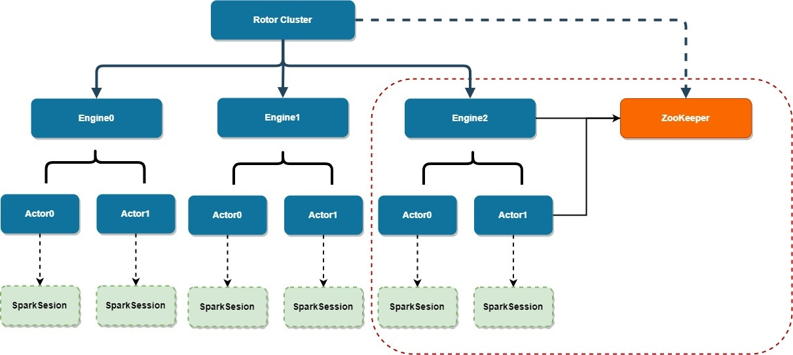

## Rotor Engine

Ad-hoc 查询引擎，基于 RQL 多源混算支持，专门为分钟级别延迟查询定制。

**RQL**
```sql
connect jdbc where `url`="jdbc:mysql://192.168.8.16:4000/database?characterEncoding=utf8" and user="root" and password="xxx" as db1;
load jdbc.`db1.tidb_attack_info` as t0;
select * from t0 as t1;
```


### Feature
基于 Spark 引擎实现的即席查询服务，提供以下功能：

- 代替 Hiveserver/Hiveserver2 和 Spark thfritserver，通过 RQL 对外提供统一的 DSL。
- 负载均衡，多引擎切换，服务自动发现。
- 多源异构数据源接入，包括File/HDFS(Text,  JSON, CSV, Parquet, ORC, Carbondata, Avro), Hive, JDBC(Mysql, PG), ES, Hbase, ClickHouse等数据源。
- 任务及资源管理。

### Architecture



### Principle
rotor 定位是多数据源的即席查询，提供分钟级别延迟的查询性能，解决数据加工到呈现的最后一公里，查询结果是面向用户所用的，无需再进行二次加工，因此最终提供的结果也是10万量级以下。
仅提供RQL的connect、load和select面向数据载入和查询功能，不提供写入。最后查询的结果也是临时保存，不做任何持久化承诺。
允许载入的数据源应该属于数仓的APP层和DM层。


### Get Started

#### 功能模块
rotor 采用SBT构建，分为engine、proxy、common、spark 4个模块。

- engine: 数据查询处理引擎，每个引擎以对应一个Spark Application，可以同时包含多个Spark Session,  每个session也对应一个Akka remote actor, 每个actor启动后会注册远程地址到zookeeper。
- proxy: 外部访问入口，以HTTP方式提供。包括任务提交、任务状态、任务取消接口以及任务监控统计。它负责和与engine remote actor通信，通过akka remote 模式进行。proxy会根据remote actor 注册到zookeeper的地址选择对应的actor交互，这里proxy也具备负责均衡的能力。
- common: 通用模块，包含一些通用组件，例如zookeer client、日志和配置相关的库。
- spark: spark相关的功能拓展。主要包括一些数据源的接入。

#### 使用
SBT 编译构建够后会生成 proxy package和engine package 两个jar包。两个jar包分别单独部署。

engine 启动

spark application 提交方式， 待补充

proxy 启动

proxy 本身是一个web APP，待补充

